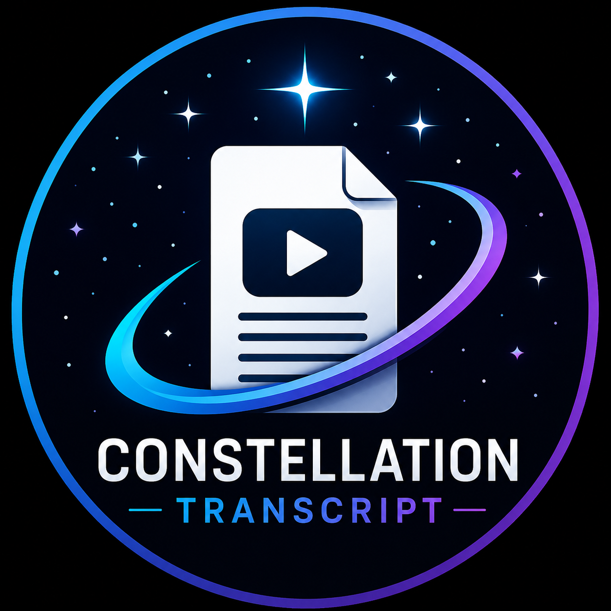

<p align="center">
  
</p>

# Constellation Transcript

Constellation Transcript converts available YouTube captions into verified
plain-text files on an Android device through Termux.

## Current capabilities

- Validates approved HTTPS YouTube URLs
- Retrieves public video metadata
- Detects manual and automatic captions
- Retrieves English captions without downloading video or audio
- Cleans WebVTT captions into readable text
- Deletes temporary caption files
- Exports transcripts using atomic file writes
- Reads exported files back to verify their contents
- Preserves existing transcripts instead of overwriting them

## Security design

- Local execution only
- No listening network services
- No remote administration
- No telemetry or analytics
- No hidden maintenance access
- No automatic code updates
- No cloud transcription
- No shell execution using untrusted URLs
- New capabilities require review before implementation

## Output location

Transcripts are saved to:

Documents/YouTubeText

## Run manually

From the project directory:

```bash
python constellation_transcript.py
